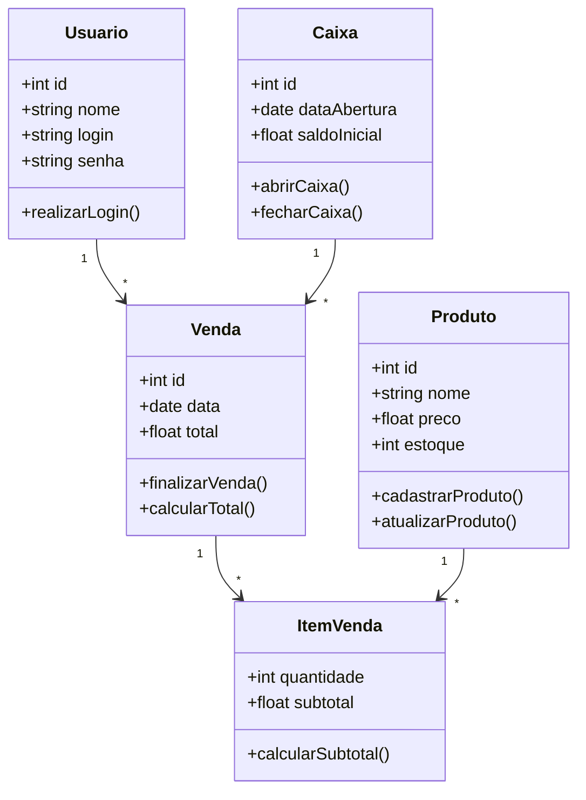

<h1>Meucadinho</h1>

<h2>Introdução</h2>

O Meucadinho é um sistema de ponto de venda (PDV) desenvolvido com o objetivo de auxiliar pequenos estabelecimentos comerciais na realização e controle de vendas.

O sistema permite registrar produtos, realizar vendas e organizar as operações realizadas no caixa de forma simples e rápida. A aplicação foi desenvolvida com foco em praticidade e facilidade de uso, permitindo que operadores de caixa realizem as vendas de maneira intuitiva.

<h4>Motivação</h4>

A motivação para o desenvolvimento do sistema surgiu da necessidade de pequenos comerciantes possuírem ferramentas simples e acessíveis para gerenciar suas vendas.

Muitos sistemas de ponto de venda disponíveis no mercado possuem custo elevado ou são complexos para pequenos negócios. Dessa forma, o Meucadinho foi desenvolvido como uma solução acadêmica que demonstra como um sistema de vendas pode ser estruturado utilizando tecnologias modernas de desenvolvimento web.

<h2>Telas do Sistema</h2>

<h3>Tela Inicial</h3>

<h3>Tela de Produtos</h3>

<h3>Tela de Usuários</h3>

<h3>Tela de Estoque</h3>

<h2>Requisitos</h2>

<h3>Histórias de Usuário</h3>

<h4>História:	Descrição</h4>

Historia 1: Como Operador de Caixa, eu quero adicionar produtos ao carrinho de vendas via código de barras ou código interno do produto, para que o atendimento seja rápido.

Historia 2: Como Operador de Caixa, eu quero buscar um produto pelo nome, para que eu consiga vender itens cuja etiqueta está ilegível.

Historia 3: Como Operador de Caixa, eu quero informar o valor recebido e ver o troco calculado na tela, se houver, para que eu não cometa erros matemáticos ao devolver o dinheiro.

Historia 4: Como Operador de Caixa, eu quero remover um item específico do carrinho de vendas atual antes de finalizar a venda, para que eu possa corrigir erros de entrada.

Historia 5: Como Operador de Caixa, eu quero informar, ao final do dia, visualizar o total vendido, para que eu possa conferir se o dinheiro na gaveta bate com o sistema.

Historia 6: Como Administrador, eu quero cadastrar, editar e excluir produtos (nome, preço de venda, código de barras e código interno), para que o catálogo de vendas esteja sempre atualizado.

Historia 7: Como Administrador, eu quero dar entrada na quantidade de estoque dos produtos, para que o sistema saiba exatamente quantos itens temos disponíveis." (Nota: O caixa só dá baixa (tira), o admin dá entrada (põe)

Historia 8: Como Administrador, eu quero cadastrar, editar e remover Operadores de Caixa e suas senhas, para que novos funcionários possam acessar o sistema.

<h3>Requisitos Não Funcionais</h3>

RNF01 – O sistema deve possuir interface simples e intuitiva para facilitar o uso pelos operadores.

RNF02 – O sistema deve responder rapidamente às ações do usuário.

RNF03 – O sistema deve funcionar em navegadores modernos.

RNF04 – O sistema deve possuir organização de código que facilite manutenção futura.

<h2>Gestão do Projeto</h2>

<h3>Metodologia Utilizada</h3>
O desenvolvimento do sistema foi realizado utilizando princípios da metodologia Scrum, uma abordagem ágil amplamente utilizada no desenvolvimento de software.
Durante o projeto, o trabalho foi organizado em sprints, nas quais foram planejadas e desenvolvidas as funcionalidades do sistema de forma incremental.

As principais cerimônias utilizadas foram:
- Planejamento de Sprint
- Desenvolvimento das tarefas
- Revisão das funcionalidades implementadas

<h3>Papéis da Equipe</h3>
Integrante	Papel
Otávio	Product Owner
Mateus	Desenvolvedor
Samuel	Desenvolvedor
Cadu	Desenvolvedor

O Product Owner (PO) foi responsável por organizar o backlog do produto e priorizar as funcionalidades a serem desenvolvidas durante o projeto.

<h2>Números do Projeto</h2>

Data de início do projeto: 19/12/2025

Total de sprints: 4

Duração média das sprints: 2 semanas

As tarefas foram organizadas e acompanhadas utilizando uma ferramenta de gestão de projetos.

<h3>Backlog Inicial</h3>

História 1
História 2
História 3
História 4
História 5
História 6
História 7
História 8

<h3>Backlog Final</h3>

História 1
História 2
História 3
História 4
História 6
História 7

<h3>Transbordo de Tarefas</h3>

Durante o desenvolvimento algumas tarefas precisaram ser reorganizadas entre sprints devido à complexidade de implementação de determinadas funcionalidades. Apesar disso, a maior parte das funcionalidades planejadas foi concluída conforme o esperado.
<h4>Histórias 5 e 8 não foram desenvolvidas</h4>

<h2>Análise e Projeto do Software</h2>
Projeto Arquitetural

O sistema Meucadinho foi desenvolvido utilizando uma arquitetura baseada na separação de responsabilidades entre os diferentes componentes da aplicação.
Essa arquitetura permite maior organização do código e facilita futuras manutenções e expansões do sistema.

<h2>Tecnologias Utilizadas</h2>

<h4>Frontend</h4>
HTML 
CSS 
JavaScript 
React 

<h4>Backend</h4>
Java  
Spring 

<h4>Banco de dados</h4>
MySQL / PostgreSQL 

<h4>Ferramentas</h4>
Git 
GitHub 
Jira (gestão do projeto) 
 

A aplicação pode ser dividida em três partes principais:
- Interface de usuário (Frontend)
- Lógica da aplicação
- Banco de dados

Projeto de Componentes

O sistema foi estruturado em diferentes módulos responsáveis por funcionalidades específicas.

Principais componentes do sistema:
- Módulo de vendas
- Módulo de gerenciamento de produtos
- Interface do usuário
- Gerenciamento de dados

Essa organização permite que cada parte do sistema seja desenvolvida e mantida de forma independente.

## Diagrama de Classes

<h4>Princípios de Projeto</h4>

Durante o desenvolvimento foram aplicados princípios importantes da engenharia de software:

<h4>Modularização</h4>
O sistema foi dividido em diferentes módulos para facilitar a organização e manutenção do código.

<h4>Reutilização de Código</h4>
Funções e componentes foram reutilizados sempre que possível, evitando duplicação de código.

<h4>Separação de Responsabilidades</h4>
Cada componente do sistema possui uma responsabilidade específica, tornando o código mais organizado e fácil de compreender.

<h2>Conclusão</h2>
Lições Aprendidas
O desenvolvimento do sistema Meucadinho permitiu aplicar na prática diversos conceitos estudados durante a disciplina de Engenharia de Software.

Entre os principais aprendizados estão:
- organização de requisitos
- planejamento de desenvolvimento em sprints
- trabalho colaborativo em equipe
- utilização de ferramentas de controle de versão

<h4>Dificuldades Encontradas</h4>

Durante o desenvolvimento do projeto algumas dificuldades foram encontradas, como:
- aprendizado das tecnologias utilizadas
- organização das tarefas do projeto
- integração entre diferentes partes do sistema
- trabalho funcional assíncrono 
